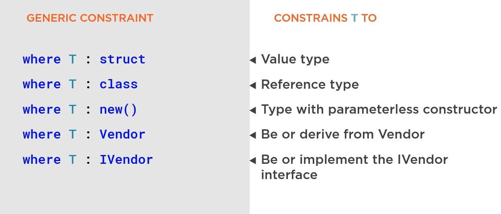

# Generics

## Generic methods
### Use cases
```
Use generics to build reausable, type neutral methods
```
```
Use 'T' as the type parameter for methods with one type parameter
```
```c#
public TReturn RetrieveValue<TReturn, TParameter>(string sql, TParameter sqlParameter)
{
	....
}
```

### Not use cases
```
Using generics when not need can cause confusion and
hard to find bugs
```
```
Using single letter names when defining multiple type parameters is 
better way to use descriptive name. Example: T -> TResult or TMessage 
```

## Constraints
.
