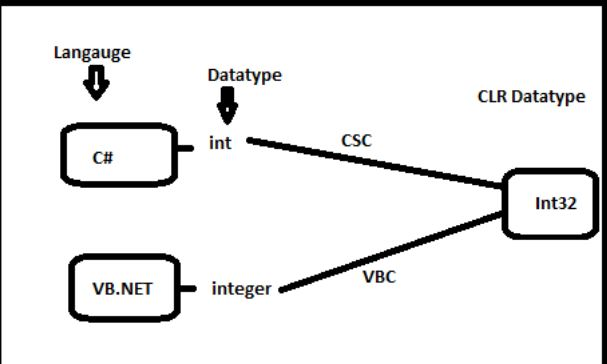
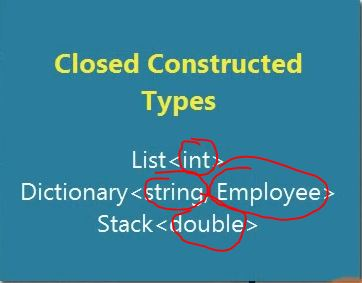

## CLS 
```
 Common Language Specification, 
```


### Closed Constructed Typed" CCT

```c#
//generic type and generic type arguments, these piece of information is called "Closed Constructed Typed" CCT
//CCT is something it can instance it 

object.GetType() + object.GetType().GenericTypeArguments;
```


### Unbound generic type
```
An unbound generic type is not itself a type, and cannot be used as the type of a variable, argument or return value, 
or as a base type. The only construct in which an unbound generic type can be referenced is the typeof expression
Its impossible to istantenced it, throw "Type.ContainsGenericParameters is true"
```

